$~$

### **Introduction**

#### Intention is to answer key business questions through Exploratory Data Analysis and Machine Learning Modeling to help Budweiser to drive potential business opportunities in the United States. The Analysis is focusing on beers and breweries as well as relationship to consumers.

$~$

#### Loading the necessary R libraries for the analysis


```r
# Load the necessary libraries
library(knitr)
library(rmarkdown)
library(ggpubr)
library(dplyr)
library(tidyr)
library(plyr)
library(ggplot2)
library(maps)
library(mapproj)
library(sf)
library(usmap)
library(urbnmapr)
library(tidyverse)
library(mice)
library(VIM)
library(lattice)
library(ggthemes)
library(e1071)
library(class)
library(caret)
library(stringr)
library(sjPlot)
library(data.table)
```


```r
# Set random seed
set.seed(329)
```

$~$

##### Reference for reproducible reseach


```r
sessionInfo()
```

```
## R version 4.1.2 (2021-11-01)
## Platform: aarch64-apple-darwin20 (64-bit)
## Running under: macOS Monterey 12.2.1
## 
## Matrix products: default
## BLAS:   /Library/Frameworks/R.framework/Versions/4.1-arm64/Resources/lib/libRblas.0.dylib
## LAPACK: /Library/Frameworks/R.framework/Versions/4.1-arm64/Resources/lib/libRlapack.dylib
## 
## locale:
## [1] en_US.UTF-8/en_US.UTF-8/en_US.UTF-8/C/en_US.UTF-8/en_US.UTF-8
## 
## attached base packages:
## [1] grid      stats     graphics  grDevices utils     datasets  methods  
## [8] base     
## 
## other attached packages:
##  [1] data.table_1.14.2   sjPlot_2.8.10       caret_6.0-90       
##  [4] class_7.3-20        e1071_1.7-9         ggthemes_4.2.4     
##  [7] lattice_0.20-45     VIM_6.1.1           colorspace_2.0-2   
## [10] mice_3.14.0         forcats_0.5.1       stringr_1.4.0      
## [13] purrr_0.3.4         readr_2.1.1         tibble_3.1.6       
## [16] tidyverse_1.3.1     urbnmapr_0.0.0.9002 usmap_0.5.2        
## [19] sf_1.0-6            mapproj_1.2.8       maps_3.4.0         
## [22] plyr_1.8.6          tidyr_1.2.0         dplyr_1.0.8        
## [25] ggpubr_0.4.0        ggplot2_3.3.5       rmarkdown_2.11     
## [28] knitr_1.37         
## 
## loaded via a namespace (and not attached):
##   [1] readxl_1.3.1         backports_1.4.1      sp_1.4-6            
##   [4] splines_4.1.2        listenv_0.8.0        TH.data_1.1-0       
##   [7] digest_0.6.29        foreach_1.5.1        htmltools_0.5.2     
##  [10] fansi_1.0.2          magrittr_2.0.2       tzdb_0.2.0          
##  [13] recipes_0.1.17       globals_0.14.0       modelr_0.1.8        
##  [16] gower_0.2.2          sandwich_3.0-1       rvest_1.0.2         
##  [19] haven_2.4.3          xfun_0.29            crayon_1.5.0        
##  [22] jsonlite_1.7.3       lme4_1.1-28          survival_3.2-13     
##  [25] zoo_1.8-9            iterators_1.0.13     glue_1.6.1          
##  [28] gtable_0.3.0         ipred_0.9-12         emmeans_1.7.2       
##  [31] sjstats_0.18.1       sjmisc_2.8.9         car_3.0-12          
##  [34] future.apply_1.8.1   DEoptimR_1.0-10      abind_1.4-5         
##  [37] scales_1.1.1         mvtnorm_1.1-3        DBI_1.1.2           
##  [40] ggeffects_1.1.1      rstatix_0.7.0        Rcpp_1.0.8          
##  [43] performance_0.8.0    xtable_1.8-4         laeken_0.5.2        
##  [46] units_0.8-0          proxy_0.4-26         stats4_4.1.2        
##  [49] lava_1.6.10          prodlim_2019.11.13   vcd_1.4-9           
##  [52] datawizard_0.2.3     httr_1.4.2           ellipsis_0.3.2      
##  [55] pkgconfig_2.0.3      nnet_7.3-16          sass_0.4.0          
##  [58] dbplyr_2.1.1         utf8_1.2.2           tidyselect_1.1.1    
##  [61] rlang_1.0.1          reshape2_1.4.4       effectsize_0.6.0.1  
##  [64] munsell_0.5.0        cellranger_1.1.0     tools_4.1.2         
##  [67] cli_3.2.0            generics_0.1.2       sjlabelled_1.1.8    
##  [70] ranger_0.13.1        broom_0.7.12         evaluate_0.14       
##  [73] fastmap_1.1.0        yaml_2.2.2           ModelMetrics_1.2.2.2
##  [76] fs_1.5.2             robustbase_0.93-9    future_1.23.0       
##  [79] nlme_3.1-153         xml2_1.3.3           compiler_4.1.2      
##  [82] rstudioapi_0.13      ggsignif_0.6.3       reprex_2.0.1        
##  [85] bslib_0.3.1          stringi_1.7.6        parameters_0.16.0   
##  [88] Matrix_1.3-4         nloptr_2.0.0         classInt_0.4-3      
##  [91] vctrs_0.3.8          pillar_1.7.0         lifecycle_1.0.1     
##  [94] lmtest_0.9-39        jquerylib_0.1.4      estimability_1.3    
##  [97] insight_0.16.0       R6_2.5.1             KernSmooth_2.23-20  
## [100] parallelly_1.30.0    codetools_0.2-18     boot_1.3-28         
## [103] MASS_7.3-54          assertthat_0.2.1     withr_2.4.3         
## [106] multcomp_1.4-18      bayestestR_0.11.5    parallel_4.1.2      
## [109] hms_1.1.1            rpart_4.1-15         timeDate_3043.102   
## [112] minqa_1.2.4          coda_0.19-4          carData_3.0-5       
## [115] pROC_1.18.0          lubridate_1.8.0
```

$~$

##### Read the data files


```r
#Read the files
beers = read.csv(file = '/Users/ttoth76/Downloads/CaseStudy1/Beers.csv', 
              sep = ',', header = TRUE)

breweries = read.csv(file = '/Users/ttoth76/Downloads/CaseStudy1/Breweries.csv', 
              sep = ',', header = TRUE)

# 3rd party data to augment current data set and provide additional insight
beers_consumption = read.csv(file = '/Users/ttoth76/Downloads/CaseStudy1/beer_consumption_by_state_2021.csv', 
              sep = ',', header = TRUE)

favorite_beer = read.csv(file = '/Users/ttoth76/Downloads/CaseStudy1/fav_beer_state.csv', 
              sep = ',', header = TRUE)
```

$~$

##### Data Preparation


```r
# verify missing values & white spaces
sapply(breweries, function(x) sum(is.na(x)))
```

```
## Brew_ID    Name    City   State 
##       0       0       0       0
```

There are no missing values in the 'breweries' data set.


```r
sapply(beers, function(x) sum(is.na(x)))
```

```
##       Name    Beer_ID        ABV        IBU Brewery_id      Style     Ounces 
##          0          0         62       1005          0          0          0
```

There are 62 missing values in the ABV and 1005 missing values in the IBU variable in the 'beers' data set.


```r
# remove leading and trailing white spaces for features required for the analysis
pattern = "(^ +| +$)"
replacement = ""
breweries$State = sub(pattern = pattern, replacement = replacement, x=breweries$State)
beers$Style = sub(pattern = pattern, replacement = replacement, x=beers$Style)
favorite_beer$full = sub(pattern = pattern, replacement = replacement, x=favorite_beer$full)
favorite_beer$fav_beer = sub(pattern = pattern, replacement = replacement, x=favorite_beer$fav_beer)
```

#### Removed leading and trailing white spaces for features required for the analysis.

$~$

#### Q1: How many breweries are present in each state?


```r
# How many breweries are present in each state?
nbs = breweries %>% group_by(State) %>% dplyr::summarise(nobrews = n())
nbs_df = as.data.frame(nbs)


# display the number of breweries on US Map with 50 states
us_map_fips = fips_info()
consumption = merge(us_map_fips, beers_consumption, 'full')
names(nbs)[names(nbs) == 'State'] = 'abbr'
nbs_map_data = merge(nbs, us_map_fips, 'abbr')
fav_beer_df = merge(nbs_map_data, favorite_beer, 'full')

names(nbs_map_data)[names(nbs_map_data) == 'abbr'] = 'state_abbv'

# create state shape file
states_shape = get_urbn_map(map = "states", sf = TRUE)
# calculate the geo centroid of each state
center_states = st_centroid(states_shape)
# get longitude and latitude data
lan_lat = str_replace_all(center_states$geometry, "[()]", "")
lan_lat_noc = str_replace_all(lan_lat, "c", "")
center_states = mutate(center_states, lan = str_split_fixed(lan_lat_noc, ",", n=2)[,1])
center_states = mutate(center_states, lat = str_split_fixed(lan_lat_noc, ",", n=2)[,2])
center_states$lan = as.numeric(center_states$lan)
center_states$lat = as.numeric(center_states$lat)
# add latitude and longitude data to breweries data set
nbs_map_data_sf = merge(nbs_map_data, center_states, by = "state_abbv")

# Plot the result (using Budweiser logo colors)
plot_usmap(data = nbs_map_data_sf, values = "nobrews", regions = "states", 
           labels = TRUE, label_color = "black") + 
  labs(title = "Number of Budweiser Breweries by US States") + 
  scale_fill_continuous(low = "white", high ="#C8102E", 
  name = "# of breweries",label = scales::comma) + 
  theme(legend.position = "right") +
  theme(panel.background=element_blank()) +
  ggrepel::geom_label_repel(data = nbs_map_data_sf,
             aes(x = lan, y = lat, label = nobrews),
             size = 8, alpha = 0.8,
             label.r = unit(0.5, "lines"), label.size = 0.5,
             segment.color = "red", segment.size = 1,
             seed = 1002) 
```

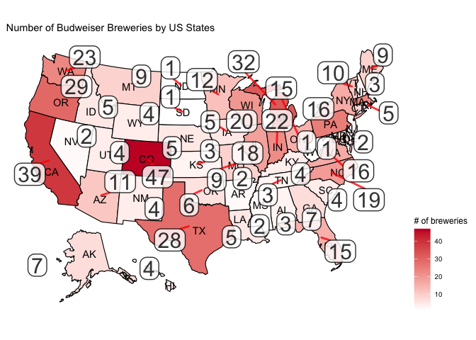<!-- -->

#### Calculated the \# of breweries and prepared the data to be displayed on a map.

#### A1: Budweiser has the most number of breweries in Colorado followed by states on the west and east coast. The number of breweries are declining as we depart from the coastal areas. Strategically placing breweries can help winning on the very competitive beer market.

#### Please note that 51 states are listed because D.C. is considered as a separate state in the data set. For this analysis we assumed that D.C. is indeed a separate state and Budweiser would like to see the analysis like that.

$~$

##### Display the number of breweries per state in descending order in a table format.

<div data-pagedtable="false">
  <script data-pagedtable-source type="application/json">
{"columns":[{"label":["State"],"name":[1],"type":["chr"],"align":["left"]},{"label":["nobrews"],"name":[2],"type":["int"],"align":["right"]}],"data":[{"1":"CO","2":"47"},{"1":"CA","2":"39"},{"1":"MI","2":"32"},{"1":"OR","2":"29"},{"1":"TX","2":"28"},{"1":"PA","2":"25"},{"1":"MA","2":"23"},{"1":"WA","2":"23"},{"1":"IN","2":"22"},{"1":"WI","2":"20"},{"1":"NC","2":"19"},{"1":"IL","2":"18"},{"1":"NY","2":"16"},{"1":"VA","2":"16"},{"1":"FL","2":"15"},{"1":"OH","2":"15"},{"1":"MN","2":"12"},{"1":"AZ","2":"11"},{"1":"VT","2":"10"},{"1":"ME","2":"9"},{"1":"MO","2":"9"},{"1":"MT","2":"9"},{"1":"CT","2":"8"},{"1":"AK","2":"7"},{"1":"GA","2":"7"},{"1":"MD","2":"7"},{"1":"OK","2":"6"},{"1":"IA","2":"5"},{"1":"ID","2":"5"},{"1":"LA","2":"5"},{"1":"NE","2":"5"},{"1":"RI","2":"5"},{"1":"HI","2":"4"},{"1":"KY","2":"4"},{"1":"NM","2":"4"},{"1":"SC","2":"4"},{"1":"UT","2":"4"},{"1":"WY","2":"4"},{"1":"AL","2":"3"},{"1":"KS","2":"3"},{"1":"NH","2":"3"},{"1":"NJ","2":"3"},{"1":"TN","2":"3"},{"1":"AR","2":"2"},{"1":"DE","2":"2"},{"1":"MS","2":"2"},{"1":"NV","2":"2"},{"1":"DC","2":"1"},{"1":"ND","2":"1"},{"1":"SD","2":"1"},{"1":"WV","2":"1"}],"options":{"columns":{"min":{},"max":[10]},"rows":{"min":[10],"max":[10]},"pages":{}}}
  </script>
</div>

$~$

##### Additional insight about beer consumption by state per capita in 2021. Purpose is to contrast the states with the highest \# of breweries with the states consuming the highest amount of beer per capita.

##### data source: <https://beerinfo.com/beer-consumption-by-state-per-capita/>


```r
# Additional insight about beer consumption by state per capita in 2021
# Purpose is to contrast the states with the highest # of breweries with the states consuming the most beer.
# data source: https://beerinfo.com/beer-consumption-by-state-per-capita/

# Plot US Map to showcase the data
plot_usmap(data = consumption, values = "consumption", regions = "states", 
           labels = TRUE, label_color = "black") + 
  labs(title = "Beer Consumption by State per Capita") + 
  scale_fill_continuous(low = "white", high ="#C8102E", 
  name = "gallons",label = scales::comma) + 
  theme(legend.position = "right") +
  theme(panel.background=element_blank())
```

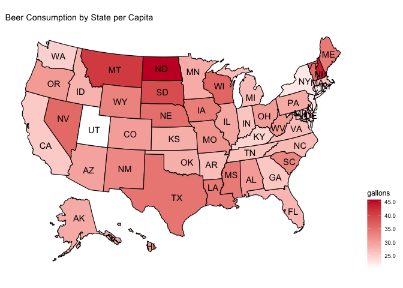<!-- -->

##### A: Based on the 3rd party data set the highest amount of beer consumption per capita by states can be observed in North Dakota, Montana and New Hampshire. Budweiser has a very low number of breweries in these states therefore these states potentially provide an opportunity to grow business and address industry production challenges.

$~$

#### Q2: Merge beer data with the breweries data. Print the first 6 observations and the last six observations to check the merged file.


```r
# Merge beer data with the breweries data. Print the first 6 observations and the last six observations to check the merged file.  

## Rename some features for easier join
names(breweries)[names(breweries) == 'Brew_ID'] = 'Brewery_id'

## Merge all the data from both data set
brew_beers = merge(breweries, beers, by = "Brewery_id")

# rename features to a more meaningful name after merge
names(brew_beers)[names(brew_beers) == 'Name.x'] = 'Brewery_Name'
names(brew_beers)[names(brew_beers) == 'Name.y'] = 'Beer_Name'
```

#### First 6 observations


```r
head(brew_beers, n=6)
```

```
##   Brewery_id       Brewery_Name        City State     Beer_Name Beer_ID   ABV
## 1          1 NorthGate Brewing  Minneapolis    MN       Pumpion    2689 0.060
## 2          1 NorthGate Brewing  Minneapolis    MN    Stronghold    2688 0.060
## 3          1 NorthGate Brewing  Minneapolis    MN   Parapet ESB    2687 0.056
## 4          1 NorthGate Brewing  Minneapolis    MN  Get Together    2692 0.045
## 5          1 NorthGate Brewing  Minneapolis    MN Maggie's Leap    2691 0.049
## 6          1 NorthGate Brewing  Minneapolis    MN    Wall's End    2690 0.048
##   IBU                               Style Ounces
## 1  38                         Pumpkin Ale     16
## 2  25                     American Porter     16
## 3  47 Extra Special / Strong Bitter (ESB)     16
## 4  50                        American IPA     16
## 5  26                  Milk / Sweet Stout     16
## 6  19                   English Brown Ale     16
```

#### Last 6 observations


```r
tail(brew_beers, n=6)
```

```
##      Brewery_id                  Brewery_Name          City State
## 2405        556         Ukiah Brewing Company         Ukiah    CA
## 2406        557       Butternuts Beer and Ale Garrattsville    NY
## 2407        557       Butternuts Beer and Ale Garrattsville    NY
## 2408        557       Butternuts Beer and Ale Garrattsville    NY
## 2409        557       Butternuts Beer and Ale Garrattsville    NY
## 2410        558 Sleeping Lady Brewing Company     Anchorage    AK
##                      Beer_Name Beer_ID   ABV IBU                   Style Ounces
## 2405             Pilsner Ukiah      98 0.055  NA         German Pilsener     12
## 2406         Porkslap Pale Ale      49 0.043  NA American Pale Ale (APA)     12
## 2407           Snapperhead IPA      51 0.068  NA            American IPA     12
## 2408         Moo Thunder Stout      50 0.049  NA      Milk / Sweet Stout     12
## 2409  Heinnieweisse Weissebier      52 0.049  NA              Hefeweizen     12
## 2410 Urban Wilderness Pale Ale      30 0.049  NA        English Pale Ale     12
```

#### A2: Merged the data from both data sets and renamed some of the fetures to more meaningful names. The key I used for the merge is: 'Brewery_id'.

$~$

#### Q3: Address the missing values in each column.


```r
# Address the missing values in each column (NA as well as empty strings).
sapply(brew_beers, function(x) sum(is.na(x)))
```

```
##   Brewery_id Brewery_Name         City        State    Beer_Name      Beer_ID 
##            0            0            0            0            0            0 
##          ABV          IBU        Style       Ounces 
##           62         1005            0            0
```

```r
sapply(brew_beers, function(x) sum(x == ""))
```

```
##   Brewery_id Brewery_Name         City        State    Beer_Name      Beer_ID 
##            0            0            0            0            0            0 
##          ABV          IBU        Style       Ounces 
##           NA           NA            5            0
```

```r
# There are 5 empty values in the Style column
# Let's replace them with NA and impute mode()
brew_beers$Style[brew_beers$Style == ""] = NA
brew_beers$Style[is.na(brew_beers$Style)] = median(brew_beers$ABV, na.rm = TRUE)

# Calculate mode for imputation
styles = unique(brew_beers$Style[!is.na(brew_beers$Style)])
style_mode = styles[which.max(tabulate(match(brew_beers$Style, styles)))]
brew_beers$Style[is.na(brew_beers$Style)] = style_mode

# Impute median IBU value by Style groups 
# I assume the IBU values are more similar in each style group therefore
# I don't take the median of all the beers' IBU but much rather grouping them by Style and calculate the 
# median. Same for the ABV content.
brew_beers = brew_beers %>%
   group_by(Style) %>%
   mutate(IBU = replace(IBU,is.na(IBU), median(IBU, na.rm = TRUE)))

# Impute median ABV value by Style groups
brew_beers = brew_beers %>%
   group_by(Style) %>%
   mutate(ABV = replace(ABV,is.na(ABV), median(ABV, na.rm = TRUE)))

# convert the tibble to data frame
brew_beers = as.data.frame(brew_beers)
```

#### A3: There are 62 ABV and 1005 IBU missing values (NA) in the dataset. There are 5 empty strings in the 'Style' vaiable in the dataset.

##### 1. I have imputed the most frequent beer style (mode) for the 5 empty string in 'Style'.

##### 2. I have imputed median value for IBU by Style group and did the same median imputation for ABV.

##### 3. I assume the IBU and ABV values are more similar in each style group therefore the values are more representative than taking the median of the entire distribution and imputing that.

##### 4. The median is robust to outliers therefore it is a better statistic for this data set than mean would be.

$~$

#### Extra insight about number of uniqe beers produced by Budweiser and contrasting it with the state where the highest number of breweries are.


```r
# Number of unique bear styles and how many of these are from Colorado where the highest number of breweries are
most_brew = brew_beers[brew_beers$State == 'CO',]
total_uniq_style = sum(count(unique(brew_beers$Style))[2])
prod_co = sum(count(unique(most_brew$Style))[2])
cat(paste0("The total number of unique style beers produced: ", total_uniq_style, "\n"),sep = "\n")
```

The total number of unique style beers produced: 100

```r
cat(paste0("Number of unique style beers produced in Colorado: ", prod_co, "\n"),sep = "\n")
```

Number of unique style beers produced in Colorado: 61

```r
cat(paste0("Colorado is producting ", prod_co/total_uniq_style*100, "% of the total beer styles.\n"),sep = "\n")
```

Colorado is producting 61% of the total beer styles.

$~$

#### Q4: Compute the median alcohol content and international bitterness unit for each state. Plot a bar chart to compare.


```r
# Compute the median alcohol content and international bitterness unit for each state. 
# Plot a bar chart to compare.

# ABV Median Values by State

ABV_IBU_State = brew_beers %>%                                      
  group_by(State) %>%                       
  summarise_at(vars(ABV, IBU),            
               list(name = median))

ABV_IBU_State = as.data.frame(ABV_IBU_State)
ABV_IBU_State = ABV_IBU_State %>% arrange(ABV_name)

ggplot(ABV_IBU_State, aes(x=State, y = ABV_name)) + 
  geom_bar(stat = 'identity', fill = '#C8102E') + 
  ggtitle('ABV Median Values by State') + 
  geom_text(aes(label = ABV_name), vjust = 0.5, hjust = -0.1,
            data = ABV_IBU_State) +
  xlab("States") + ylab("median")+
  coord_flip() + 
  theme(legend.position = "none") + theme_tufte() + theme(plot.title = element_text(hjust = 0.5))
```

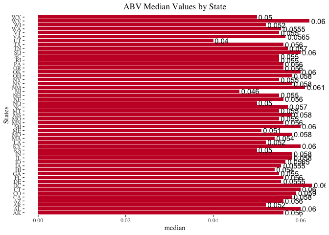<!-- -->

```r
#IBU Median Values by State
ggplot(ABV_IBU_State, aes(x=State, y = IBU_name)) + 
  geom_bar(stat = 'identity', fill = '#C8102E') + 
  ggtitle('IBU Median Values by State') + 
  geom_text(aes(label = IBU_name), vjust = 0.5, hjust = -0.1, 
            data = ABV_IBU_State) +
  xlab("States") + ylab("Median")+
  theme(legend.position = "none") + coord_flip() + theme_tufte() + theme(plot.title = element_text(hjust = 0.5))
```

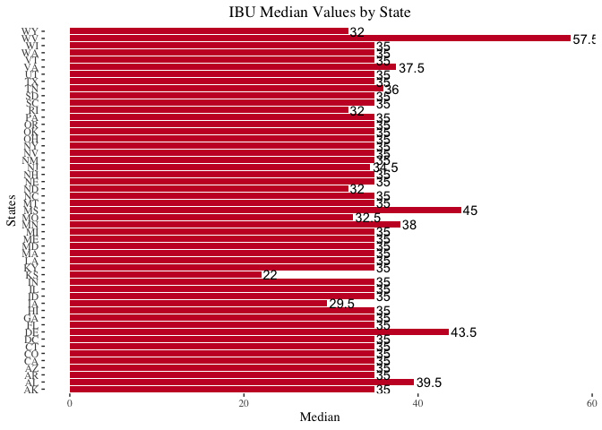<!-- -->

#### A4: The median alcohol content varies by state. The lowest alcohol content is 0.04 in UT. The highest alcohol content is 0.06. The median alcohol content has no large variation among the states. Budweiser is producing miled alcohol content beers.

#### The median IBU values are very uniform, at around 35. The lowest is 22 in KS and the highest is 57.5 in WV. There were a lot of IBU values missing from the data set and median values were imputed based on Sytle groups. This could potentially result to this uniform values of 35 per states.

$~$

#### Q5: Which state has the maximum alcoholic (ABV) beer?


```r
#Which state has the maximum alcoholic (ABV) beer? Which state has the most bitter (IBU) beer?
max_abv = as.data.frame(brew_beers[which.max(brew_beers$ABV),])
max_abv$fips = 08
max_ibu = brew_beers[which.max(brew_beers$IBU),]
max_ibu$fips = 41
long_co = -580957.756

#display the max ABV state on the map
plot_usmap(data = max_abv, values = "ABV",include = c("CO"),labels = FALSE, label_color = "white") +
  labs(title = "Colorado") +
  scale_fill_continuous(low = "white", high ="#C8102E", 
  name = "# of breweries",label = scales::comma) + 
  theme(legend.position = "none") +
  theme(panel.background=element_blank()) +
  ggrepel::geom_label_repel(data = max_abv,
             aes(x = -479518.34, y = long_co*1.150490688483037, label = paste('ABV =', ABV)),
             size = 4, alpha = 0.8,
             #label.r = unit(0.5, "lines"), label.size = 0.5,
             segment.color = "red", segment.size = 1,
             seed = 1002) +
  
  ggrepel::geom_label_repel(data = max_abv,
             aes(x = -479518.34, y = long_co, label = "Colorado"),
             size = 4, alpha = 0.8,
             label.r = unit(0.5, "lines"), label.size = 0.5,
             segment.color = "red", segment.size = 1,
             seed = 1002) +
  
   ggrepel::geom_label_repel(data = max_abv,
             aes(x = -479518.34, y = long_co*1.05163886649273, label = Brewery_Name),
             size = 4, alpha = 0.8,
             label.r = unit(0.5, "lines"), label.size = 0.5,
             segment.color = "red", segment.size = 1,
             seed = 1002) +
  
  ggrepel::geom_label_repel(data = max_abv,
             aes(x = -479518.34, y = long_co*1.100064777487883, label = Beer_Name),
             size = 4, alpha = 0.8,
             label.r = unit(0.5, "lines"), label.size = 0.5,
             segment.color = "red", segment.size = 1,
             seed = 1002)
```

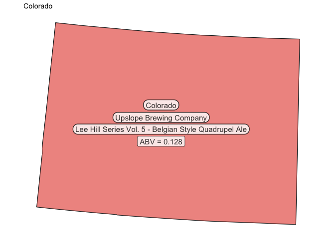<!-- -->

##### Calculated the median ABV values and displayed them on the map of the respective state.

#### A5: Colorado is producing the highest alcohol content beer with 12.8%. This beer is produced in Upslope Brewing Company and it is a Belgian Style Ale.

$~$

#### Q5: Which state has the most bitter (IBU) beer?


```r
#display the max IBU state on the map
long_or = 180000.391
plot_usmap(data = max_ibu, values = "IBU",include = c("OR"),labels = FALSE, label_color = "white") +
  labs(title = "Oregon") +
  scale_fill_continuous(low = "white", high ="#C8102E", 
  name = "# of breweries",label = scales::comma) + 
  theme(legend.position = "none") +
  theme(panel.background=element_blank()) +
  ggrepel::geom_label_repel(data = max_ibu,
             aes(x = -1624240.82, y = long_or*0.402223368670349, label = paste('IBU =', IBU)),
             size = 4, alpha = 0.8,
             label.r = unit(0.5, "lines"), label.size = 0.5,
             segment.color = "red", segment.size = 1,
             seed = 1002) +
  ggrepel::geom_label_repel(data = max_ibu,
             aes(x = -1624240.82, y = long_or, label = "Oregon"),
             size = 4, alpha = 0.8,
             label.r = unit(0.5, "lines"), label.size = 0.5,
             segment.color = "red", segment.size = 1,
             seed = 1002) +

ggrepel::geom_label_repel(data = max_ibu,
             aes(x = -1624240.82, y = long_or*(143000.391/long_or), label = Brewery_Name),
             size = 4, alpha = 0.8,
             label.r = unit(0.5, "lines"), label.size = 0.5,
             segment.color = "red", segment.size = 1,
             seed = 1002) +
  
ggrepel::geom_label_repel(data = max_ibu,
             aes(x = -1624240.82, y = long_or*(108000.391/long_or), label = Beer_Name),
             size = 4, alpha = 0.8,
             label.r = unit(0.5, "lines"), label.size = 0.5,
             segment.color = "red", segment.size = 1,
             seed = 1002) 
```

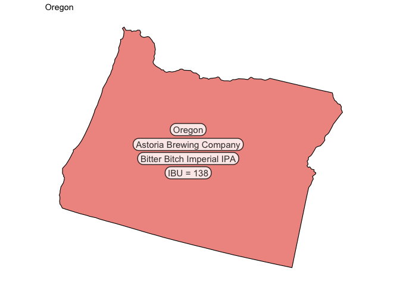<!-- -->

##### Calculated the median IBU values and displayed them on the map of the respective state.

#### A5: Oregon is producing the most bitter beer with 138 IBU value. This beer is produced in Astoria Brewing Company and it is a Bitter Bitch Imperial IPA.

$~$

#### Q6: Comment on the summary statistics and distribution of the ABV variable.


```r
# Comment on the summary statistics and distribution of the ABV variable.
summary(brew_beers$ABV)
```

```
##    Min. 1st Qu.  Median    Mean 3rd Qu.    Max. 
## 0.00100 0.05000 0.05600 0.05968 0.06700 0.12800
```

```r
# Plot the distribution for ABV
par(mfrow=c(1,2))
hist(brew_beers$ABV, main = 'ABV distribution', col ="#C8102E", xlab = 'Alcoholic Content')
boxplot(brew_beers$ABV, main = 'ABV distribution', col ="#C8102E", ylab = 'Alcoholic Content')
means = mean(brew_beers$ABV)
points(means,col="yellow",pch=18)
```

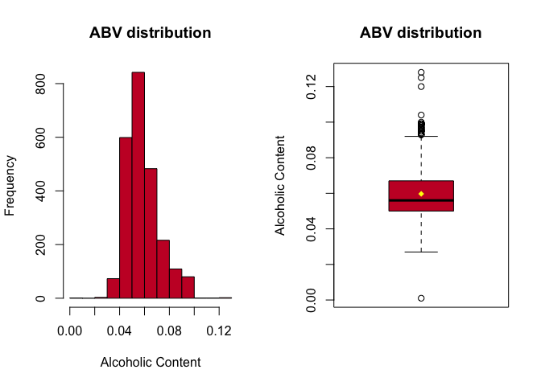<!-- -->

##### Created a histogram and boxplot for ABV values as well as a summary statistics.

#### A6:

#### 1. Alcohol content is ranging between 0.001 and 0.128

#### 2. 25% of the products alcohol content is less than or equal to 0.05

#### 3. 50% of the products alcohol content is above and below of 0.056

#### 4. 75% of the products alcohol content is less than or equal to 0.067

#### 5. Average alcohol content of the products is 0.059

#### 6. Product portfolio is mostly comprised of mild alcohol content beers

#### 7. There is no reason to believe that the ABV data set is not coming from a normal distribution.

$~$

#### Q7: Is there an apparent relationship between the bitterness of the beer and its alcoholic content? Draw a scatter plot. Make your best judgment of a relationship and EXPLAIN your answer.


```r
# Is there an apparent relationship between the bitterness of the beer and its alcoholic content? 
# Draw a scatter plot.  Make your best judgment of a relationship and EXPLAIN your answer.

beers %>% 
ggplot(aes(x = ABV, y = IBU)) + geom_point(color = "#C8102E", shape=1) + 
  geom_smooth(method = "lm", color = "#00A1E1") + ggtitle("Correlation between IBU and ABV") + 
  xlab("ABV") + ylab("IBU") + 
  theme_tufte() +
  theme(plot.title = element_text(hjust = 0.5))
```

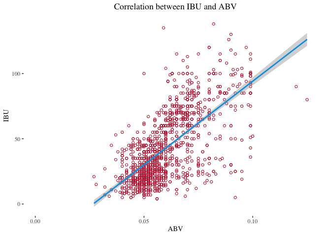<!-- -->

```r
pearson_r = cor(brew_beers$ABV, brew_beers$IBU, use = "everything")
print(paste0('The pearson correlation coefficient is: ',  pearson_r))
```

```
## [1] "The pearson correlation coefficient is: 0.514133946293589"
```

##### Built a scatterplot with a regression line.

#### A7: Visualy inspecting the scatterplot we can conclude that there is a positive linear relationship between ABV and IBU. The beer alcohol content increase is associated with the bitternes. \~26% of the variance in IBU can be explained by changes in ABV.

$~$

#### Q8: Budweiser would also like to investigate the difference with respect to IBU and ABV between IPAs (India Pale Ales) and other types of Ale (any beer with "Ale" in its name other than IPA). You decide to use KNN classification to investigate this relationship. Provide statistical evidence one way or the other.


```r
# Budweiser would also like to investigate the difference with respect to IBU and ABV # between IPAs (India Pale Ales) and other types of Ale (any beer with “Ale” in its 
# name other than IPA).  You decide to use KNN classification to investigate this 
# relationship.  Provide statistical evidence one way or the other. 

# Prepare data set for the KNN model. Let's filter for IPAs and Ales

data_for_modeling = brew_beers %>% dplyr::select(Style, ABV, IBU, Ounces)
data_for_modeling$Style = gsub(".*(IPA).*", "\\1", data_for_modeling$Style, ignore.case = TRUE)
data_for_modeling$Style = gsub(".*(\\bAle\\b).*", "\\1", data_for_modeling$Style, ignore.case = TRUE)
data_for_modeling = filter(data_for_modeling, Style == 'IPA' | Style == 'Ale')

# Let's standardize the data as we have 100 fold difference between IBU and ABV
data_for_modeling = mutate(data_for_modeling, Z_ABV = scale(data_for_modeling$ABV))
data_for_modeling = mutate(data_for_modeling, Z_IBU = scale(data_for_modeling$IBU))
data_for_modeling = mutate(data_for_modeling, Z_Ounces = scale(data_for_modeling$Ounces))

ale_count = count(data_for_modeling[data_for_modeling$Style == 'Ale','Style'])[2]
ale_percent = (count(data_for_modeling[data_for_modeling$Style == 'Ale','Style'])[2] / dim(data_for_modeling)[1])*100
cat(paste0('There are ', ale_count, " Ale style beers in the data set", "\n"),sep = "\n")
```

```
## There are 963 Ale style beers in the data set
```

```r
IPA_count = count(data_for_modeling[data_for_modeling$Style == 'IPA','Style'])[2]
IPA_percent = (count(data_for_modeling[data_for_modeling$Style == 'IPA','Style'])[2] / dim(data_for_modeling)[1])*100

cat(paste0('There are ', IPA_count, " IPA style beers in the data set", "\n"),sep = "\n")
```

```
## There are 571 IPA style beers in the data set
```

```r
# 70/30 split of the data set to train the models:
train_70 = sample(1:dim(data_for_modeling)[1], round(0.7*dim(data_for_modeling)[1]))
train = data_for_modeling[train_70,]
test = data_for_modeling[-train_70,]
```

###### Prepared data set for the KNN model and filtered for IPAs and Ales using regex.

###### Standardized the data for the KNN model.

###### 70/30 split of the data set to train the models:

##### Let's test the variance of the ABV and IBU variables.


```r
#Test EQUAL VARIANCE with boxplot
par(mfrow=c(1,2))
hist(data_for_modeling$ABV, main = 'ABV distribution', col ="#C8102E", xlab = 'Alcoholic Content')
hist(data_for_modeling$IBU, main = 'IBU distribution', col ="#C8102E", xlab = 'International Bitternes Unit')
```

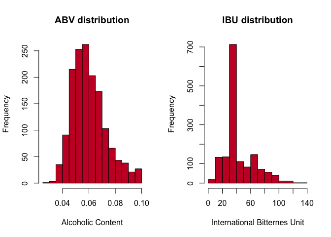<!-- -->

##### We can observe that the standard deviations are different. Earlier we have seen that we have enough sample size that CLT applies therefore we can assume normality. We can also assume independence.

#### I will run a Welch's two-sample t-test to see if the mean IBU and ABV values are equal or different. This will help drawing statistical conclusion about the importance of the variables predecting the Syle of beer. If we don't find statistical significance than it will mean that the variables are not good predictors for beer style and thus there is no reason to run a KNN model.

$~$

#### A two sample t-test to prove difference between ABV and IBU


```r
t.test(data_for_modeling$ABV, data_for_modeling$IBU, alternative = 'two.sided', var.equal = FALSE)
```

```
## 
## 	Welch Two Sample t-test
## 
## data:  data_for_modeling$ABV and data_for_modeling$IBU
## t = -79.068, df = 1533, p-value < 2.2e-16
## alternative hypothesis: true difference in means is not equal to 0
## 95 percent confidence interval:
##  -45.23597 -43.04587
## sample estimates:
##   mean of x   mean of y 
##  0.06116428 44.20208605
```

##### We have enough evidence to suggest that the IBU and ABV mean values are different and thus these two variables are good predictors for beer Style. (p-value \< 2.2e-16 )

$~$

#### Solution using KNN model


```r
# Solution with KNN model
# Let's determine the best k value first based on accuracy

Accuracy_matrix = matrix(nrow=100)
                        
for (i in 1:100)
{
  CM = confusionMatrix(table(knn(train[,c("Z_ABV", "Z_IBU")], test[,c("Z_ABV", "Z_IBU")], train$Style, k = i, prob = TRUE), test$Style))$overall[1]
  Accuracy_matrix[i]=CM
}

best_k = which.max(Accuracy_matrix)

fit = knn(train[,c("Z_ABV", "Z_IBU")], test[,c("Z_ABV", "Z_IBU")], train$Style, k = best_k, prob = FALSE)
confusionMatrix(table(fit, test$Style))
```

```
## Confusion Matrix and Statistics
## 
##      
## fit   Ale IPA
##   Ale 243  52
##   IPA  38 127
##                                           
##                Accuracy : 0.8043          
##                  95% CI : (0.7651, 0.8396)
##     No Information Rate : 0.6109          
##     P-Value [Acc > NIR] : <2e-16          
##                                           
##                   Kappa : 0.5825          
##                                           
##  Mcnemar's Test P-Value : 0.1706          
##                                           
##             Sensitivity : 0.8648          
##             Specificity : 0.7095          
##          Pos Pred Value : 0.8237          
##          Neg Pred Value : 0.7697          
##              Prevalence : 0.6109          
##          Detection Rate : 0.5283          
##    Detection Prevalence : 0.6413          
##       Balanced Accuracy : 0.7871          
##                                           
##        'Positive' Class : Ale             
## 
```

##### As a first step I standardized the data because there is a 100 fold difference between ABV and IBU which impacts the distnce calculation for the KNN model.

##### I have tuned the KNN model by finding the most optimal k-value by selecting the one with the highest Accuracy value out of 100 iterations.

##### Based on the confusion matrix above, we have been able to correctly classify 243 Ale and 127 IPA style beers. Overall accuracy of the prediction is \~80% which underpins the previous conclusions about ABV and IBU are being good predictors to determin the style of the beer.

##### The misclassification rate is 38/460 = 0.083 (8.3%).

$~$

#### Let's plot the KNN classes to gain further insights about the difference.


```r
# Plot predicted values
plot.df = data.frame(test, predicted = fit)
plot.df1 = data.frame(x = plot.df$ABV, 
                      y = plot.df$IBU, 
                      predicted = plot.df$predicted)

find_hull = function(df) df[chull(df$x, df$y), ]
boundary = ddply(plot.df1, .variables = "predicted", .fun = find_hull)

predict_plot = ggplot(plot.df, aes(ABV, IBU, color = predicted, fill = predicted)) + 
  geom_point(size = 5) + 
  geom_polygon(data = boundary, aes(x,y), alpha = 0.5)

# Plot original data
plot.df1 = data.frame(x = plot.df$ABV, 
                      y = plot.df$IBU, 
                      Style = plot.df$Style)

find_hull = function(df) df[chull(df$x, df$y), ]
boundary = ddply(plot.df1, .variables = "Style", .fun = find_hull)

orig_labels = ggplot(plot.df, aes(ABV, IBU, color = Style, fill = Style)) + 
  geom_point(size = 5) + 
  geom_polygon(data = boundary, aes(x,y), alpha = 0.5)

ggarrange(orig_labels,predict_plot,
                labels=c("Observations","Predictions"),
                 ncol=1,nrow=2)
```

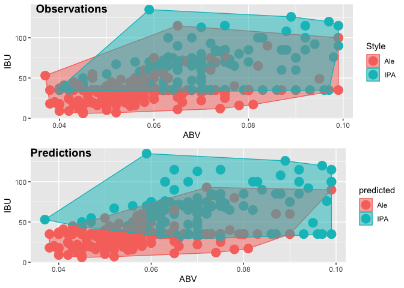<!-- -->

##### **Observations**: Original labeled data

##### **Predictions**: The labels predicted by the KNN model based on ABV and IBU values

##### Visually comparing the Observations and Predictions we can observe that the KNN model is predicting the lables fairly well and the model is generalizing well for this data set.

##### The model predicts ALEs with IBU above 95 and ABV above 0.06 as IPA. It seems like that a more bitter and stringer beer would represent IPA rather than ALE for the model. IPAs are predicted more consistantly however some of the lower alcohol content and lower IBU IPAs are predicted as ALEs.

$~$

#### Let's look at Naive Bayes model prediction to compare perfomrance with the KNN model.


```r
# Solution with NB model
model = naiveBayes(train[,c('ABV','IBU')],train$Style)
  CM = confusionMatrix(table(predict(model, test[,c('ABV','IBU')], type = 'class'), test$Style))
  CM
```

```
## Confusion Matrix and Statistics
## 
##      
##       Ale IPA
##   Ale 260  76
##   IPA  21 103
##                                          
##                Accuracy : 0.7891         
##                  95% CI : (0.749, 0.8255)
##     No Information Rate : 0.6109         
##     P-Value [Acc > NIR] : < 2.2e-16      
##                                          
##                   Kappa : 0.5303         
##                                          
##  Mcnemar's Test P-Value : 4.185e-08      
##                                          
##             Sensitivity : 0.9253         
##             Specificity : 0.5754         
##          Pos Pred Value : 0.7738         
##          Neg Pred Value : 0.8306         
##              Prevalence : 0.6109         
##          Detection Rate : 0.5652         
##    Detection Prevalence : 0.7304         
##       Balanced Accuracy : 0.7503         
##                                          
##        'Positive' Class : Ale            
## 
```

##### The accuracy of the NB model is not as good as the KNN model so I will not investigate this solution further.

$~$

#### Q9. Knock their socks off! Find one other useful inference from the data that you feel Budweiser may be able to find value in. You must convince them why it is important and back up your conviction with appropriate statistical evidence.

$~$

##### States where Budweiser is the most popular beer vs. \# of breweries vs. highest beer consumprion


```r
# 3rd party data set from https://www.thedrinksbusiness.com/2021/10/the-most-popular-beer-in-every-us-state/
fav_beer_bud = filter(fav_beer_df, fav_beer == 'Budweiser')
budw_sf = subset(nbs_map_data_sf, state_abbv %in% fav_beer_bud$abbr)
fav_beer_bud = merge(fav_beer_bud, consumption, 'full')
names(fav_beer_bud)[names(fav_beer_bud) == 'fips.x'] = 'fips'

# Plot those states only where Budweiser is the most popular
  plot_usmap(data = fav_beer_bud, values = "consumption",include = fav_beer_bud$abbr.x,
  labels = TRUE, label_color = "black") +
  labs(title = "States where Budweiser is the most popular beer vs. # of breweries vs. highest beer consumprion") +
  scale_fill_continuous(low = "white", high ="#C8102E", 
  name = "Beer Consumption (gal)",label = scales::comma) + 
  theme(legend.position = "right") +
  #theme(panel.background=element_blank()) +
  ggrepel::geom_label_repel(data = budw_sf,
             aes(x = lan, y = lat, label = nobrews),
             size = 4, alpha = 0.8,
             label.r = unit(0.5, "lines"), label.size = 0.3,
             segment.color = "red", segment.size = 1,
             seed = 1002) 
```

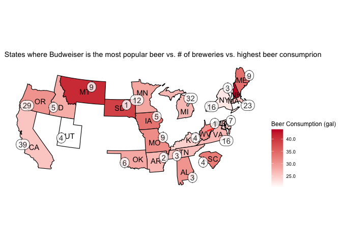<!-- -->

##### Plot those states only where Budweiser is the most popular.

##### Budweiser is a most popular beer in 23 states. Based on this map I can see opportunities for Budweiser to further increase their presence in those states where their beer is the most popular by increasing the number of breweries. Budweiser has very low number of breweries in these states however consumption is the highest and Budweiser is the most popular beer: MT, SD, NH, WV, IA and SC. Further to the potential increase in sales in these states the supply chain cost may be reduced as well by local distributions.

$~$

#### **Summary**

###### - Used 4 data sets for the analysis.

###### \* Beers

###### \* Breweries

###### \* Beer Consumption by State per Capita (2021)

###### \* The most popular beer in every US state (2021)

###### - Identified missing values in ABV and IBU as well as empty string in Style variables.

###### - Budweiser have 558 breweries in the United States. The top five states with the highest number of breweries are:

###### 1. CO - 47

###### 2. CA - 39

###### 3. MI - 32

###### 4. OR - 29

###### 5. TX - 28

###### -ND, NH and MT are the states with the highest amount of beer consumption per capita per state. Contrary to this, Budweiser have very low number of breweries in these states.

###### -The total number of unique style beers produced by Budweiser is 100.

###### -Number of unique style beers produced in Colorado: 61

###### -Colorado is producting 61% of the total beer styles Budweiser has in its portfolio.

###### -Median ABV values by state are uniformly distributed and ranging between 4% and 6%.

###### -Median IBU values by state are uniformly distributed and ranging between 22 and 57.5.

###### -Colorado is producing the highest alcohol content beer with 12.8%. This beer is produced in Upslope Brewing Company and it is a Belgian Style Ale.

###### -Oregon is producing the most bitter beer with 138 IBU value. This beer is produced in Astoria Brewing Company and it is a Bitter Bitch Imperial IPA.

###### 1. The products alcohol content is ranging between 0.001 and 0.128

###### 2. 25% of the products alcohol content is less than or equal to 0.05

###### 3. 50% of the products alcohol content is above and below of 0.056

###### 4. 75% of the products alcohol content is less than or equal to 0.067

###### 5. Average alcohol content of the products is 0.059

###### 6. Product portfolio is mostly comprised of mild alcohol content beers

###### 7. There is no reason to believe that the ABV data set is not coming from a normal distribution.

###### -There is a positive linear relationship between ABV and IBU. The beer alcohol content increase is associated with the bitterness. \~26% of the variance in IBU can be explained by changes in ABV.

###### -Built a KNN model to investigate the difference with respect to IBU and ABV between IPAs and Ales.

###### -The KNN model predicted the beer style classes with \~80% accuracy and 8.3% misclassification rate.

###### -This KNN model generalizes well on this data set and we can conclude that ABV and IBU are good verables predicting the sytle of the beers.

###### -The model predicts ALEs with IBU above 95 and ABV above 0.06 as IPA. It seems like that a more bitter and stringer beer would represent IPA rather than ALE for the model. IPAs are predicted more consistantly however some of the lower alcohol content and lower IBU IPAs are predicted as ALEs.

###### -Built a Naive Bayes model for the prediction but the model performance was not as good as the KNN one therefore I did not pursue this model further.

###### -Budweiser is the most popular beer in 23 states.

$~$

#### **Recommendations**

##### 1. There is an opportunity to increse data quality for the ABV and IBU variables.

##### 2. I recommend Budweiser to carry out a market analysis in ND, NH, and MT to better understand potential market opportunities to increase sales given the high amount of beer consumption in these states.

##### 3. Study the beer styles to see if there is a need to reclassify some of the beers from IPA to Ale and vice versa based on ABV and IBU values. This could better represent product quality and beer taste which in return could result in more customers.

##### 4. I can see opportunities for Budweiser to further increase their presence in those states where their beer is the most popular by increasing the number of breweries. Budweiser has very low number of breweries in these states however consumption is the highest and Budweiser is the most popular beer: MT, SD, NH, WV, IA and SC. Further to the potential increase in sales in these states the supply chain cost may be reduced as well by local distributions.

$~$
